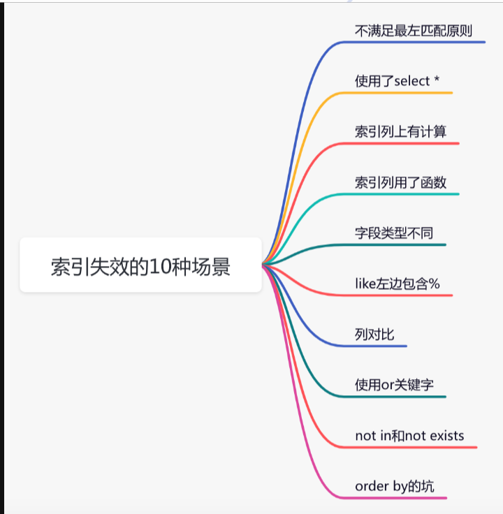

# 数据库和MyBatis知识点


#### MySQL和Oracle的默认事务隔离级别:

MySQL 默认的事务隔离级别是 **Repeatable Read（可重复读）**。

这意味着在一个事务中，读取的数据集是事务开始时的状态，事务期间其他事务对同一数据的修改对当前事务是不可见的，直到当前事务结束。这可以防止脏读和不可重复读，但不能防止幻读。

Oracle 默认的事务隔离级别是 **Read Committed（读已提交）**。

在这个级别下，一个事务只能读到已经被其他事务提交的数据。这可以避免脏读，但在同一个事务中的两次相同的查询可能返回不同的结果，因为其他事务可能在两次查询之间提交了数据。

需要注意的是，虽然 Oracle 默认的事务隔离级别是 Read Committed，但 Oracle 提供了更高级别的隔离级别，如 Serializable，以及通过使用锁来实现更严格的控制。


#### 数据库连接池的配置参数

数据库连接池的配置参数会根据具体的数据库连接池实现而有所不同，但通常会包括以下一些常见的配置参数：

1. **连接池大小参数**：
   - **initialSize**：初始连接池大小，即初始化时创建的连接数量。
   - **maxActive**：最大活动连接数，即连接池中最大允许的同时活动连接数量。
   - **minIdle**：最小空闲连接数，连接池中保持的最小空闲连接数量。
   - **maxIdle**：最大空闲连接数，连接池中保持的最大空闲连接数量。
2. **连接参数**：
   - **url**：数据库连接地址。
   - **username**：数据库用户名。
   - **password**：数据库密码。
3. **连接超时参数**：
   - **maxWait**：最大等待时间，当连接池中的连接已经用尽时，等待获取连接的最大等待时间。
4. **连接验证参数**：
   - **testOnBorrow**：从连接池中获取连接时是否进行连接有效性验证。
   - **testOnReturn**：将连接返回到连接池时是否进行连接有效性验证。
   - **validationQuery**：用于验证连接是否有效的 SQL 查询语句。
   - **validationInterval**：连接空闲时是否定期执行连接验证的间隔时间。
5. **其他参数**：
   - **timeBetweenEvictionRunsMillis**：连接池中连接空闲检测周期。
   - **minEvictableIdleTimeMillis**：连接在连接池中保持空闲的最小时间。
   - **removeAbandoned**：是否移除长时间未使用的连接。
   - **removeAbandonedTimeout**：长时间未使用的连接超时时间。

这些是一些常见的数据库连接池配置参数，具体的配置参数还可能会因为使用的数据库连接池实现而有所不同。在使用数据库连接池时，需要根据实际情况进行适当的配置，以满足应用程序的需求，并保证数据库连接的稳定和高效使用。


#### MyBatis的一级缓存,二级缓存

MyBatis 提供了一级缓存和二级缓存来提高数据库查询性能和减少数据库访问次数。

一级缓存（Local Cache）

- **作用范围**：一级缓存是 MyBatis 中默认开启的缓存机制，作用范围是 SqlSession 级别的。
- **存储位置**：一级缓存存储在 SqlSession 中，是一个基于 Per-Request 的缓存。在同一个 SqlSession 中执行的相同 SQL 语句会从缓存中获取结果，而不会再次发送 SQL 请求到数据库。
- **生命周期**：一级缓存的生命周期是和 SqlSession 绑定的，即在 SqlSession 关闭之前有效。当 SqlSession 关闭时，一级缓存也会被清空。

二级缓存（Global Cache）

- **作用范围**：二级缓存是在 SqlSessionFactory 级别上进行管理的，它的作用范围是跨 SqlSession 的。
- **存储位置**：二级缓存存储在 SqlSessionFactory 中，是一个基于 Per-Application 的缓存。多个 SqlSession 共享同一个二级缓存，可以跨 SqlSession 共享缓存数据。
- **生命周期**：二级缓存的生命周期是和应用程序的生命周期相同的，即在应用程序运行期间有效。
- **配置和开启**：需要在 MyBatis 的配置文件中显式地配置开启二级缓存，并且在需要使用二级缓存的 Mapper 中配置 `<cache>` 元素。

两者关系

- 一级缓存是 SqlSession 级别的缓存，而二级缓存是 SqlSessionFactory 级别的缓存，它们的作用范围不同。
- 二级缓存可以跨 SqlSession 共享数据，而一级缓存只能在同一个 SqlSession 中共享数据。
- 二级缓存适用于需要在多个 SqlSession 中共享数据的场景，一级缓存适用于短期内频繁查询的场景。

在实际应用中，需要根据具体的业务场景和性能需求来决定是否使用一级缓存和二级缓存。需要注意的是，尽管二级缓存能够提高数据的共享和性能，但在并发环境下也可能引起数据一致性的问题，因此在配置和使用二级缓存时需要慎重考虑。

开启:

1. 在 MyBatis 配置文件中添加 `<settings>` 元素，并在其中配置开启二级缓存的属性。

```
xmlCopy code
<configuration>
    <!-- 其他配置 -->
    <settings>
        <!-- 开启二级缓存 -->
        <setting name="cacheEnabled" value="true"/>
    </settings>
    <!-- 其他配置 -->
</configuration>
```


#### 索引的失效场景

索引失效是指数据库索引在某些情况下无法有效利用索引来加速查询，导致性能下降。索引失效的场景主要包括以下几种情况：

1. **未使用索引列进行查询**：如果查询语句中未使用索引列进行过滤或者排序，那么数据库无法利用索引来提高查询性能。
2. **函数操作索引列**：如果查询语句中对索引列进行了函数操作，如使用了 `SUBSTR`、`UPPER` 等函数，会导致索引失效。因为函数操作改变了索引列的原始值，使得索引无法直接匹配查询条件。
3. **隐式类型转换**：如果查询语句中的索引列类型与查询条件的类型不一致，数据库可能会进行隐式类型转换。这样会导致索引失效，因为查询条件的类型与索引列的类型不匹配。
4. **使用通配符查询**：如果查询语句中使用了通配符查询，如 `LIKE '%keyword%'`，索引也会失效。因为通配符查询无法利用索引的 B+ 树结构进行匹配，导致全表扫描。
5. **数据量过小**：如果表中的数据量很小，数据库优化器可能会选择全表扫描而不是利用索引进行查询，这时索引也会失效。
6. **对索引列进行计算**：如果查询语句中对索引列进行了计算，如 `WHERE column + 1 = ?`，索引也无法被利用。
7. **索引列参与了 OR 条件**：如果查询语句中的条件是 `OR` 关系，并且其中的条件涉及多个索引列，索引可能会失效。
8. **表连接查询**：如果查询涉及多个表的连接操作，索引可能会失效。特别是在没有适当的索引覆盖时，数据库可能会选择全表扫描。
9. **索引列有 NULL 值**：如果索引列包含了大量的 NULL 值，而查询语句中又使用了 IS NULL 或 IS NOT NULL 条件，索引可能会失效。

在实际开发中，为了保证索引的有效使用，需要合理设计索引，避免出现以上导致索引失效的情况。同时，可以通过数据库的性能调优工具和分析执行计划来发现和解决索引失效的问题。




#### 什么是覆盖索引

覆盖索引是指索引能够完全覆盖一个查询，并且查询的结果可以直接从索引中获取，而不需要去访问表的数据行。具体来说，当一个查询的所有列都包含在一个或多个索引的索引键中，并且查询的条件中只涉及到索引键，而不涉及到表的其他列时，就可以称之为覆盖索引。

使用覆盖索引可以带来以下几点好处：

1. **减少 IO 操作**：由于查询结果可以直接从索引中获取，不需要访问表的数据行，因此可以减少对磁盘的读取操作，提高查询性能。
2. **减少内存消耗**：由于不需要缓存大量的数据行，可以减少内存消耗，提高内存利用率。
3. **减少 CPU 开销**：不需要对查询结果进行排序和过滤，可以减少 CPU 的计算开销，提高查询效率。

需要注意的是，覆盖索引适用于一些特定的查询场景，例如查询中只包含索引列，并且不涉及到表的其他列。在设计索引时，可以根据查询的特点来考虑是否创建覆盖索引，以提高查询性能。


#### explain执行计划详解